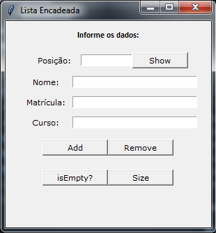

# Primeiro projeto da disciplina de Estruturas da Dados do Curso Superior de Tecnologia em Sistemas para Internet do IFPB

## O objetivo deste projeto é implementar as principais estruturas de dados lineares: Listas, Pilhas e Filas em Python.

Foram implementadas as seguintes classes:
* Classe No: Representa a informação sendo manipulada nas estruturas lineares;
* Classe Lista: Classe contendo os principais métodos para a manipulação de uma lista;
* Classe Pilha: Classe contendo os principais métodos para a manipulação de uma pilha;
* Classe Fila: Classe contendo os principais métodos para a manipulação de uma fila.

As classes Lista, Pilha e Fila contêm os seguintes métodos:
* Adicionar: Adiciona um elemento em qualquer posição. No caso de Pilhas e Filas, existem regras para a adição de novos elementos;
* Remover: Remove um elemento de qualquer posição. No caso de Pilhas e Filas, a remoção não pode ocorrer em qualquer posição;
* Vazio: Retorna verdadeiro se a estrutura estiver vazia e falso caso contrário;
* Tamanho: Retorna quantos elementos a estrutura possui;
* Mostrar Elemento: Mostra o valor de um elemento em uma determinada posição. No caso de Pilhas e Filas, esse método só pode apresentar o valor do dado que está no início da estrutura.

